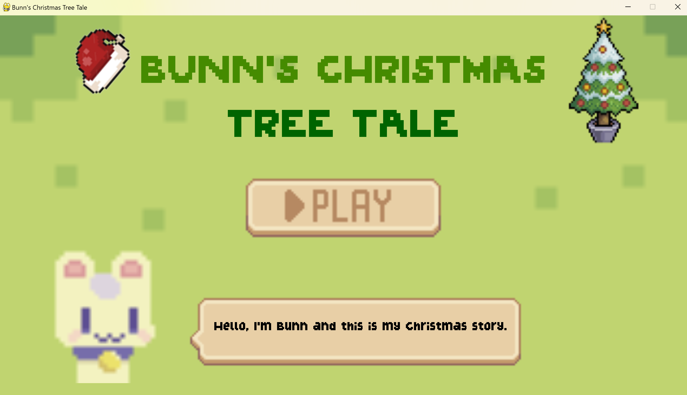
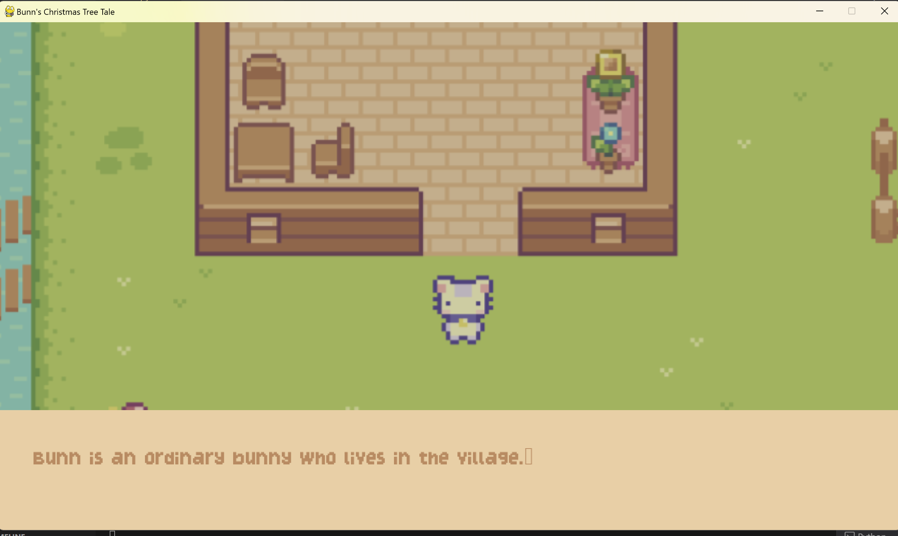
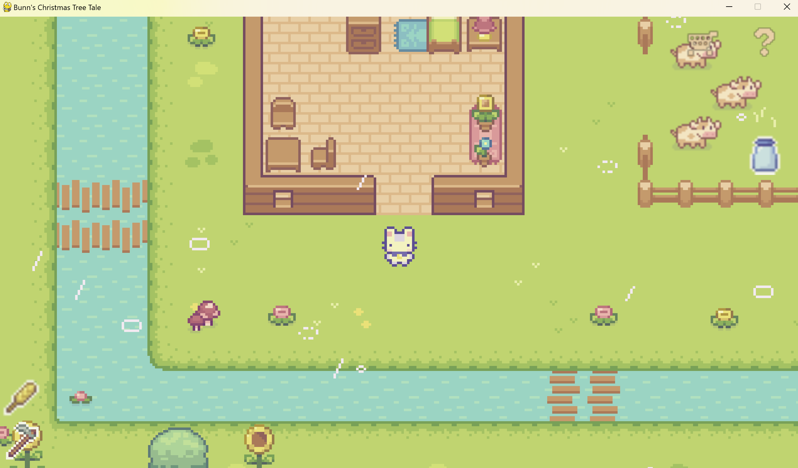
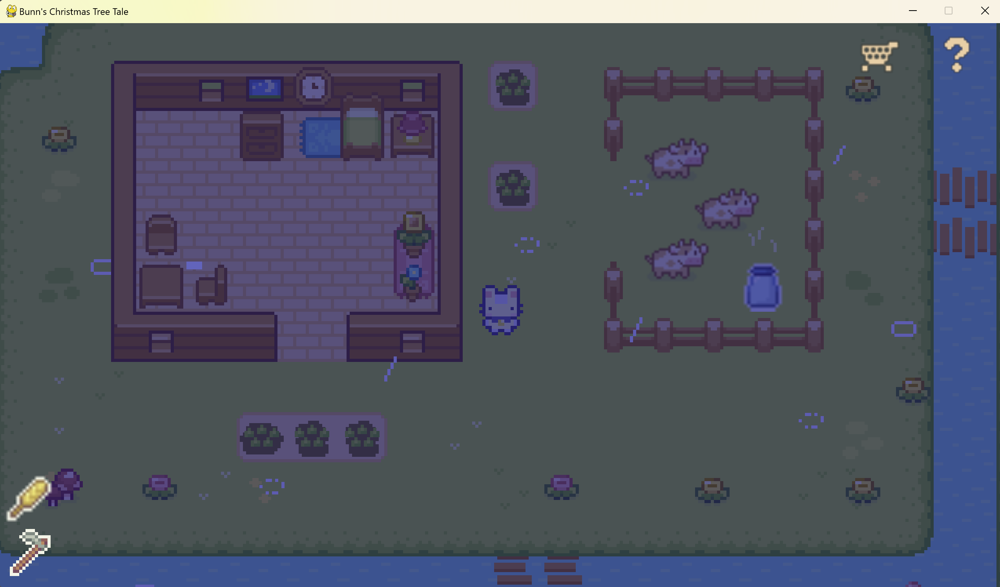

# Algorithm and Programming Final Project - Bunn's Christmas Tree Tale

**Name:** Ella Raputri

**Class:** L1AC

**Student ID:** 2702298154

<br>

## Project Description
Bunn's Christmas Tree Tale is a story-based game that revolves around the life of Bunn, an ordinary bunny who just lost his grandpa. Help Bunn to bestir himself from the sorrow of losing his grandpa. In this farming game, players can explore, farm, feed cows, and do transactions. 

This game consists of only two game states: the intro menu and the main game. It also has four cutscenes.

<br>

## Demo Video
To access the demo video, click [here](https://drive.google.com/drive/folders/1ZcvX6MUAlmGKkGYil1Ovckh-kZ7DIWcr?usp=sharing)

<br>

## Libraries Used
- Pygame - a set of Python modules to create game. 
- PyTMX or Python Tiled Map XML - a set of Python modules specified to load and handle maps for games.
- random - a built-in module that is used to generate random choices or numbers.
- os - a built-in module that contains methods to handle and interact with the operating system. 
- sys - a built-in module that provides various functions and variables to manipulate the Python runtime environment. 

<br>

## Files
- 'audio' folder, contains the background music and the sound effects for this game.
- 'code' folder, contains the Python code of this game.
- 'data' folder, contains the .tmx file map for this game’s ground background and several .tsx files inside the tilesets folder. 
- 'document' folder, contains the documentation (report and diagrams) for this project. 
- 'font' folder, contains the font types that are used in the game.
- 'graphics' folder, contains all of the game picture assets. 
- 'story' folder, contains four .txt files that are the story or the narration for each cutscene of this game.

<br>

## Codes (inside 'code' folder)
- cutscene.py, handles cutscenes
- game_display.py, contains the setup for the map and the game function.
- game_settings.py, contains the constant values of some variables that are used in the game
- intro.py, manages the intro menu
- main.py, contains the class Game that is used to handle methods to run the game (contains the game loop). 
- merchant_menu.py, contains shop menu configuration.
- overlay_menu.py, contains the help menu and inventory configuration.
- overlay.py, handles the bottom left images for the tool and seed status.
- player.py, manages player.
- sky.py, manages day-night transition and rain.
- soil.py, manages soillayers, soiltiles, and plants.
- sprites.py, contains configuration for sprite objects.
- support.py contains additional classes and functions to help other file.
- transition.py, manages transition when player is sleeping.

<br>

## How to Install 
- Install Python and Visual Studio Code on your computer. 
- Open Visual Studio Code terminal and install Pygame and PyTMX by typing this code below.
    ```
    pip install pygame
    pip install pytmx
    ```
- Download and extract the zip file of this repository.
- Open the main.py file in Visual Studio Code.
- Run the main.py file.
- Now, you can play this game.

<br>

## Game Screenshots

Intro Menu



<br>
Cutscene



<br>
Daytime



<br>
Nighttime



